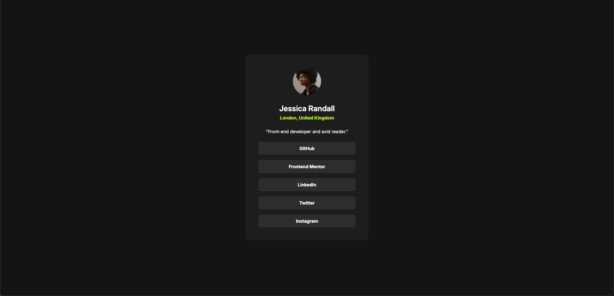

# Frontend Mentor - Social Links Profile Solution

This is my solution for the Frontend Mentor "Social Links Profile" challenge.
這是我在 Frontend Mentor 上的 QRCODE 組件挑戰練習。Frontend Mentor 的挑戰可以幫助我提升對於編寫程式的能力。

## Table of contents

- [Overview 概覽](#overview_概覽)
  - [Screenshot 截圖](#screenshot_截圖)
  - [Links 連結](#links_連結)
- [My process 完成過程](#my-process_完成過程)

  - [Built with 使用技術](#built-with_使用技術)
  - [What I learned 學習收穫](#what-i-learned_學習收穫)
  - [Continued development 將來改進](#continued-development_將來改進)

- [Author 作者](#author作者)

## Overview\_概覽

### Screenshot\_截圖

### Links\_連結

- Solution URL: [https://github.com/ylin320/Social-links-profile](https://github.com/ylin320/Social-links-profile)
- Live Site URL: [https://ylin320.github.io/Social-links-profile/](https://ylin320.github.io/Social-links-profile/)

## My process\_完成過程

### Built with\_使用技術

- Semantic HTML5 markup
- CSS custom properties
- Flexbox
- Mobile-first workflow
- Responsive Design

### What I learned\_學習收穫

I initially found that .card size was not adjusting properly. After debugging, I realized the issue was caused by .links elements having width: 100%. Since buttons were taking the full width of .links, but .card did not explicitly have width: 100%, its size was inconsistent. The solution was to set .card { width: 100%; } to ensure it expands properly with its content and maintains a stable layout.
我發現 .card 的大小無法正確調整，經過調試後發現問題出在 .links 設定了 width: 100%。由於按鈕填滿 .links 的整個寬度，但 .card 並未明確設定 width: 100%，導致其尺寸不穩定。解決方法是為 .card 添加 width: 100%，確保它能隨內容正確擴展並保持穩定的佈局。

### Continued development\_將來改進

I plan to further improve my CSS skills, particularly in enhancing hover effects for smoother interactions and better alignment with the design prototype.
我將繼續探索 CSS，特別是優化 hover 效果，使其更平滑，並與設計原型更加一致。

## Author\_作者

- GitHub - [@ylin320](https://github.com/ylin320)
- Frontend Mentor - [@ylin320](https://www.frontendmentor.io/profile/ylin320)
